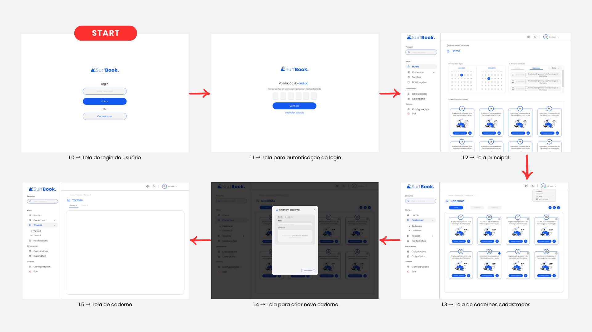
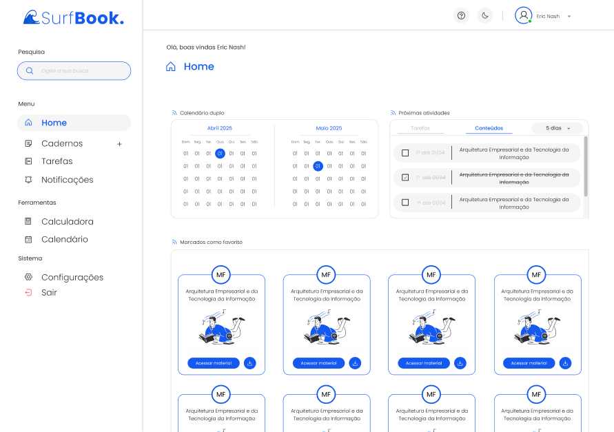

# Projeto de Interface

O SurfBook foi desenvolvido com base em uma lógica de navegação simples, clara e centrada no usuário, refletida nos wireframes que representam as principais telas do sistema. Estes protótipos interativos oferecem uma visão geral da jornada do usuário pela plataforma, mapeando como ele interage com os recursos oferecidos e como esses recursos se organizam para atender às suas necessidades acadêmicas.

As interfaces principais incluem:

- Tela de Cadastro/Login: Primeiro ponto de contato do usuário com a plataforma, permitindo a criação de uma conta ou o acesso com credenciais previamente cadastradas, conforme o requisito funcional.
- Dashboard Principal: Após o login, o usuário acessa um painel que resume seu progresso, conteúdos recentes, tarefas pendentes e um calendário integrado.
- Gestão de Cursos e Conteúdos: Interfaces que permitem cadastrar, editar e visualizar cursos e conteúdos, organizados por disciplina e com possibilidade de classificação por tags e links entre conteúdos.
- Histórico e Revisão de Estudos: Telas que fornecem acesso a um histórico detalhado de alterações e conteúdos estudados, alinhando-se às histórias de usuários que buscam revisar conhecimentos passados.
- Compartilhamento e Colaboração: Funcionalidade para compartilhar cadernos com outros usuários, incentivando a troca de informações e estudos em grupo.

Esses protótipos foram concebidos considerando os requisitos funcionais e não funcionais definidos na documentação, como a necessidade de responsividade para dispositivos móveis, acessibilidade para leitores de tela e compatibilidade com navegadores modernos.

Além disso, cada elemento da interface foi pensado para responder às histórias de usuários, como o aluno que deseja organizar seus estudos para otimizar o tempo ou o ex-aluno que busca revisar conteúdos já estudados. A estrutura modular e visualmente limpa do SurfBook permite que essas ações sejam executadas com facilidade e autonomia.

## User Flow

## Wireframes

O wireframe do SurfBook é uma representação visual que ilustra a estrutura inicial da página, destacando a organização dos principais componentes, como menus de navegação, botões, imagens e seções de conteúdo. Ele funciona como um esboço funcional que orienta a construção da interface, permitindo visualizar como as informações serão distribuídas e acessadas no site.

[Projeto de interface no FIGMA](https://www.figma.com/design/a19wJCdWpouCZO9xG20Gga/SurfBook-V2?node-id=0-1&m=dev&t=VHI75c5sTqeKY4eP-1)
