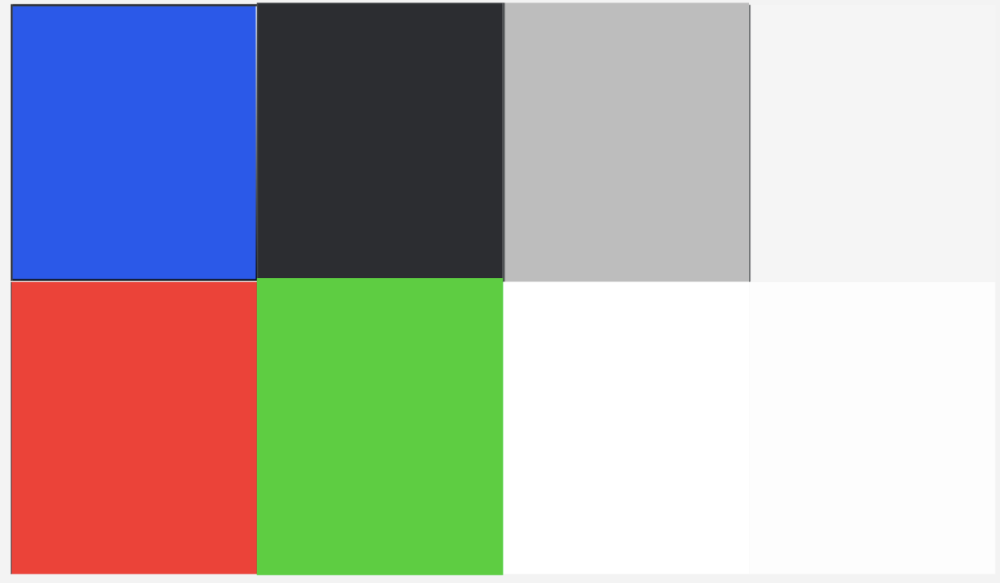

# **Projeto SurfBook: Template Padrão de Aplicação**

Este documento tem como objetivo passar as informações básicas sobre como será desenvolvido o sistema surfbook. Apresentando o Template padrão de aplicação, paleta de cores, Layout Padrão, Tela de validação de código, Tipografia, Iconografia e Logo. 

O layout padrão do site foi construído com as linguagens de marcação HTML e CSS. 

- Cores: RGB:  #145AF1,  #2B2D31,  #BDBDBD,  #F5F5F5,  #FF2B2B,  #00D018,  #FFFFFF,  #FDFDFD. 
- Font-family: Poppins. 
- Font size: 6, 8, 10, 12, 14, 16, 20, 24, 40.

 ## **Layout Padrão Tela de Login** 

   

   Essa tela o usuário que estiver utilizando tem que utilizar o seu email para fazer login no sistema SurfBook.

   ## **Tela Principal** 

   
   
   Esta é a tela principal do sistema, que conta com um menu lateral contendo as seguintes opções: Home, Cadernos, Tarefas, Notificações, Calculadora, Calendário, Configurações e Sair. Ao clicar em cada uma dessas opções, o sistema exibirá uma nova funcionalidade ao usuário final.

Além disso, há um painel de atividades que apresenta as matérias cadastradas, as atividades e os estudos programados, bem como um calendário para acompanhar esses compromissos. 

   ## **Modal de cadastro de caderno** 

   

  Este modal permite ao usuário criar um novo caderno dentro do sistema, facilitando a organização de conteúdos e atividades.

   ## **Tipografia** 

   

   Estas são as fontes tipográficas utilizadas na criação do design do sistema.

   ## **Iconografia**

   

Os ícones utilizados no sistema foram retirados da biblioteca Phosphor Icons.

   

Os ícones utilizados no sistema foram extraídos da biblioteca Iconify

   ## **Logo**

A logo do sistema foi criada pelos próprios membros da equipe.

[Projeto de interface no FIGMA](https://www.figma.com/design/a19wJCdWpouCZO9xG20Gga/SurfBook-V2?node-id=0-1&m=dev&t=VHI75c5sTqeKY4eP-1)
