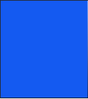
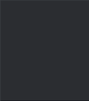
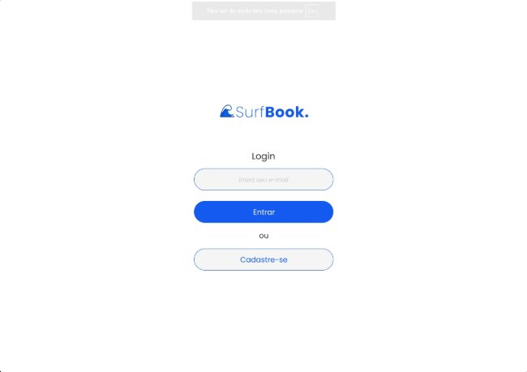
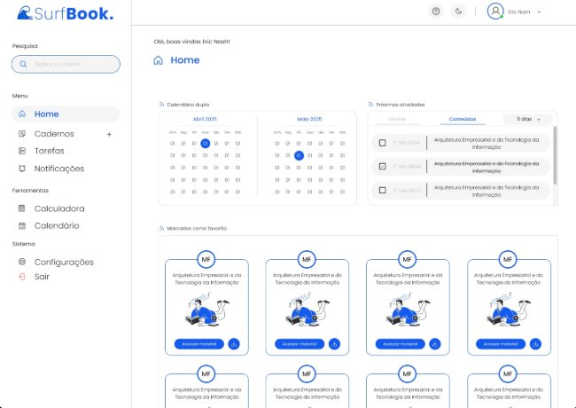
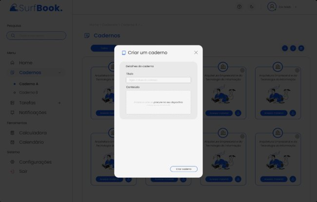
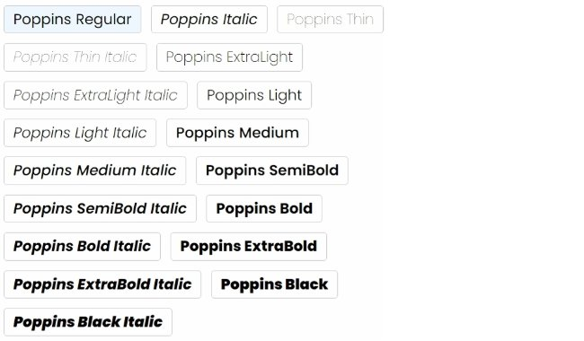
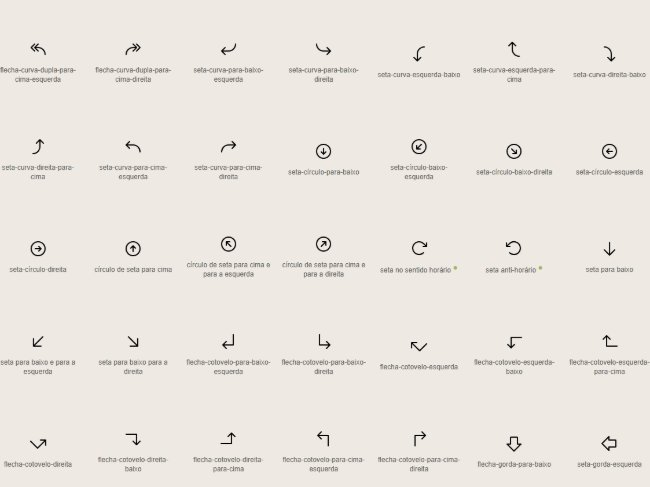
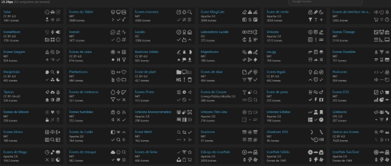
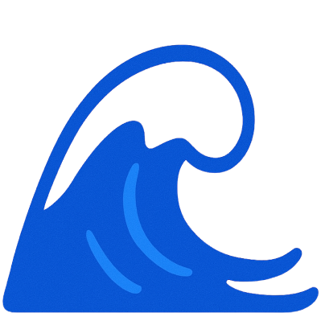

**Projeto SurfBook: Template Padrão de Aplicação**

Este documento tem como objetivo passar as informações básicas sobre como será desenvolvido o sistema surfbook. Apresentando o Template padrão de aplicação, paleta de cores, Layout Padrão, Tela de validação de código, Tipografia, Iconografia e Logo. 

O layout padrão do site foi construído com as linguagens de marcação HTML e CSS. 

- Cores: RGB:  #145AF1,  #2B2D31,  #BDBDBD,  #F5F5F5,  #FF2B2B,  #00D018,  #FFFFFF,  #FDFDFD. 
- Font-family: Poppins. 
- Font size: 6, 8, 10, 12, 14, 16, 20, 24, 40.

- RGB:  #145AF1,  #2B2D31,  #BDBDBD,  #F5F5F5,  #FF2B2B,  #00D018,  #FFFFFF,  #FDFDFD. 
3. **Layout Padrão Tela de Login** 

   

   Essa tela o usuário que estiver utilizando tem que utilizar o seu email para fazer login no sistema SurfBook.

   **Tela de validação de código** 

   Essa tela o usuário que estiver utilizando tem que  colocar o código que será enviado ao e-mail do usuário após ele tentar fazer login.

   **Tela Principal** 

   Essa é a tela principal do sistema, onde temos menus laterais com opções como: Home, Cadernos, Tarefas, Notificações, Calculadora, Calendário, Configurações e Sair. Em que, ao clicar em cada opção o sistema apresentará uma nova funcionalidade dele ao usuário final. 

   Além disso, temos um painel de atividade, mostrando as ‘matérias’ cadastradas, as atividades  e estudos a serem realizados num futuro e um calendário para o acompanhamento das mesmas. 

   **Modal de cadastro de caderno** 

   

   Esse é o modal para criação de um novo caderno no sistema. 

   **Tipografia** 

   

   Fontes que foram utilizadas para o design do sistema. 

   **Iconografia **

   

   Icones da biblioteca phosphor. 

   

   Ícones da biblioteca iconify.

   **Logo **

Logo desenvolvido pelos membros para o sistema. 

