

# Projeto SurfBook
Manual de Testes SurfBook

## Product:  SurfBook

Object:  Version 1.0

1. Sobre o Documento

Este documento tem como objetivo apresentar as informações básicas e funcionalidades desenvolvidas sobre a aplicação web Surfbook. 

2. CT 01: Cadastro de usuário

Para acessar o sistema SurfBook, basta clicar no link: [SurfBook](https://surfbook.netlify.app/src/pages/login-v2.html). O usuário será redirecionado para a tela de login, onde teremos as opções: ‘Entrar’ e ‘Cadastrar’. 

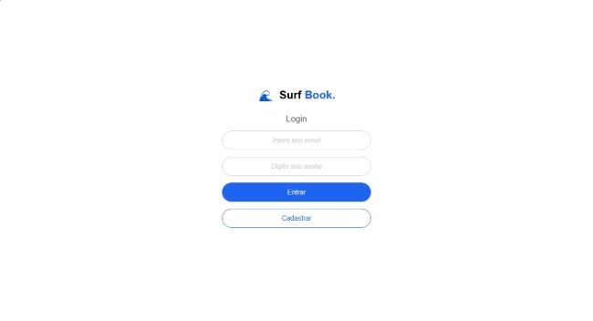

Começemos por: ‘Cadastrar’.

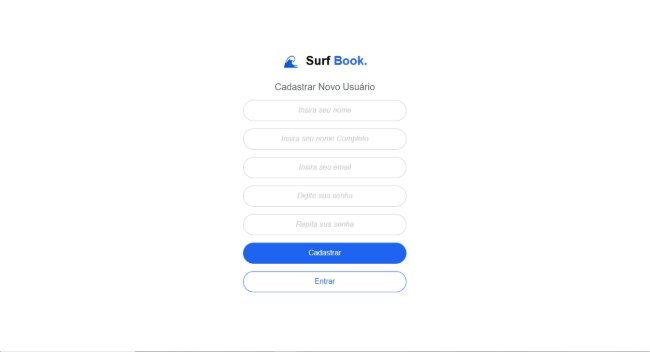

Ao clicar no botão "Cadastrar", o usuário será direcionado para a tela de cadastro, onde deverá fornecer seu nome completo, endereço de email, senha e confirmar a senha para criar uma nova conta.

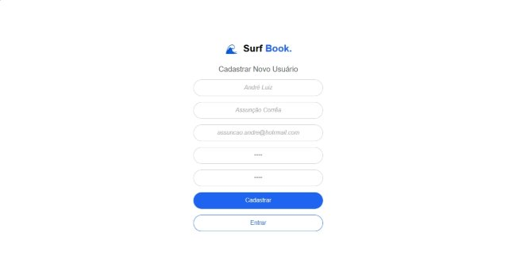

Ao clicar em "Cadastrar", o sistema irá redirecioná-lo para o menu principal, já com seu usuário criado e logado.

3. CT 02: Tela de login do sistema

Na tela de login, insira o email e a senha cadastrados nos respectivos campos e clique no botão "Entrar" para acessar o sistema.

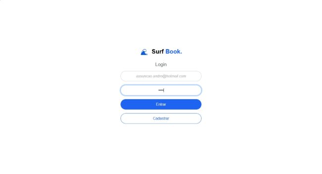

Ao clicar em "Entrar", o sistema o redirecionará para a tela "Home", ou tela principal do sistema.

4. CT 03: Cadastro de caderno

Ao acessar o sistema com seu usuário, você será redirecionado automaticamente para a tela "Home", onde é realizado o cadastro dos cadernos.

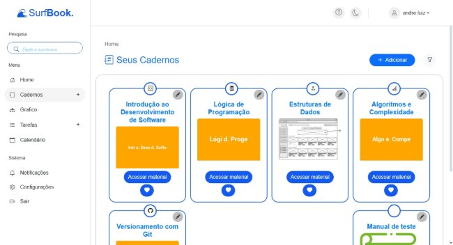

Ao exibir os cadernos cadastrados, o sistema apresentará cada um em seu respectivo card.

Para criar um novo caderno, basta clicar no botão "+ Adicionar".

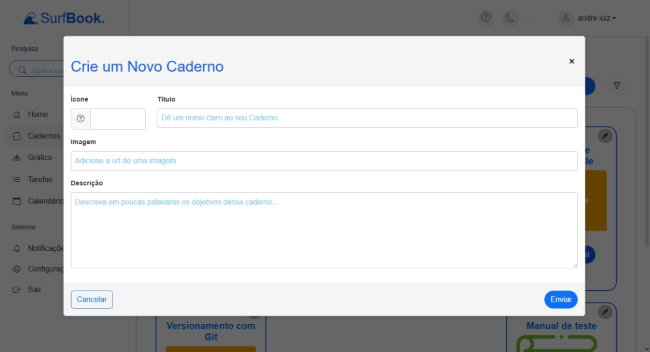

Ao clicar no botão, o sistema abrirá um modal de cadastro de caderno, onde será possível personalizar seu caderno online da forma que desejar.

Para criar um caderno, clique no botão de ícone e selecione um. Em seguida, escolha um título, insira uma descrição e, se desejar, cadastre uma imagem para representar seu caderno.

Para adicionar uma imagem, copie o link de uma imagem da internet e cole-o no campo correspondente do sistema.

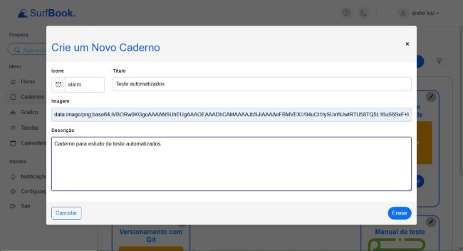

Ao preencher os campos, basta clicar em enviar e seu caderno será criado. 

![ref3]

Após a criação do caderno, o card correspondente será exibido no sistema desta forma.

5. CT 04: Edição do caderno

No card do caderno, basta clicar no ícone de lápis para que o sistema abra o modal de edição.

![ref3]

Ao clicar, o sistema abrirá o modal de edição, onde será possível alterar os mesmos campos preenchidos durante o cadastro. Para confirmar as alterações, basta clicar no botão "Enviar".

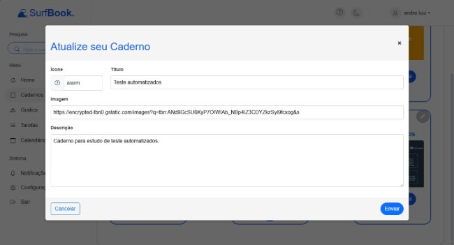

6. CT 05: Listagem pela pesquisa

Na tela "Home", você pode visualizar, no canto superior esquerdo, o campo de "Pesquisa". Ao digitar um termo relacionado aos dados de caderno ou conteúdo, o sistema exibirá o caderno correspondente à sua busca.

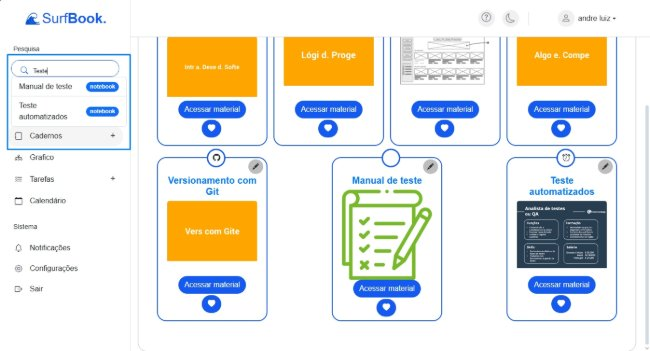

Para acessar o conteúdo desejado, basta clicar no item correspondente à sua busca.

7. CT 06: Cadastro de um conteúdo

No card do caderno, clique em "Acesse material". O sistema irá redirecioná-lo para a tela do caderno, onde será possível criar um novo conteúdo. Para isso, clique em "+ Adicionar".

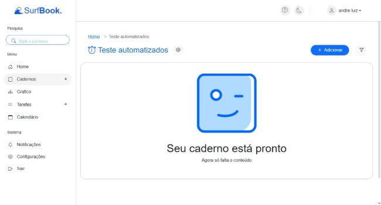

Preencha os campos "Ícone", "Título" e "Tags". Após preencher, clique em "Enviar".

Para adicionar as tags, digite o nome desejado e pressione a tecla Enter do teclado.

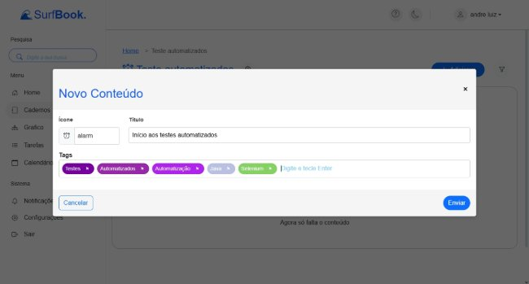

Após criar o conteúdo, ele será exibido da seguinte forma.

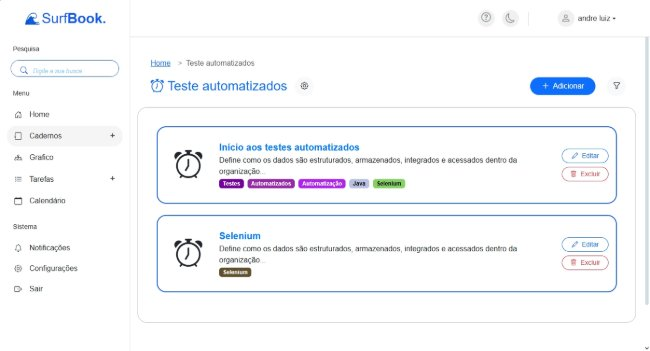

8. CT 07: Edição de um conteúdo.

Para editar as informações de um conteúdo cadastrado, basta clicar no botão "Editar" correspondente a ele.

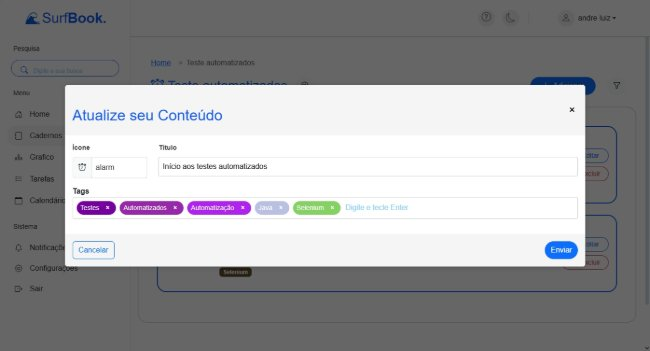

Ao clicar no botão "Editar", o sistema abrirá o modal de edição do conteúdo, permitindo alterar todos os itens adicionados no cadastro. Para confirmar as alterações, basta clicar no botão "Enviar".

9. CT 08: Pesquisa de conteúdo

No campo de pesquisa, localizado no canto esquerdo da tela, você pode buscar o conteúdo desejado utilizando as tags ou o título.

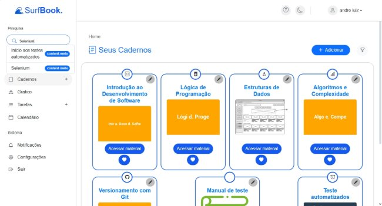

Para pesquisar, digite o que deseja no campo "Pesquisa" e, ao aparecer o item correspondente, clique nele. O sistema irá redirecioná-lo para começar a escrever ou visualizar o conteúdo selecionado.

10. CT 16: Link entre conteúdos

Para criar um link entre dois conteúdos, o usuário precisa cadastrar a mesma tag em ambos durante o cadastro ou edição dos conteúdos.

Primeiro, acesse o primeiro conteúdo no qual deseja fazer o link e preencha as tags desejadas.

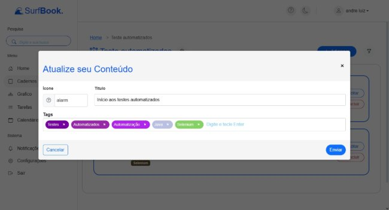

Em seguida, no segundo conteúdo, insira uma das tags cadastradas no primeiro conteúdo.

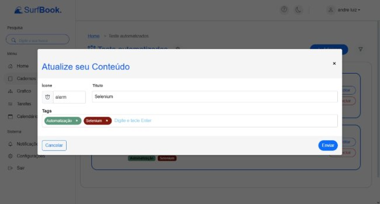

Após isso, o link entre os conteúdos ficará ativo, podendo ser visualizado na tela de Gráficos.

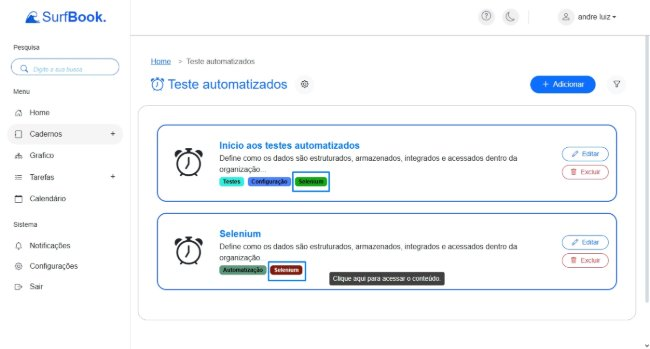

11. CT 17: Visualização Gráfica.

No menu lateral esquerdo, clique no botão "Gráficos". Ao fazer isso, o sistema o redirecionará para uma tela onde será possível visualizar os cadernos de forma gráfica.

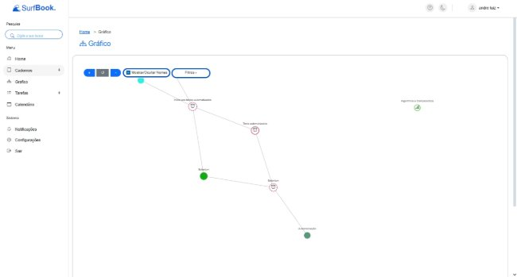

A visualização do gráfico pode ser alterada conforme a preferência do usuário. Para fazer essa alteração, basta clicar no botão "Filtro" localizado acima do gráfico.

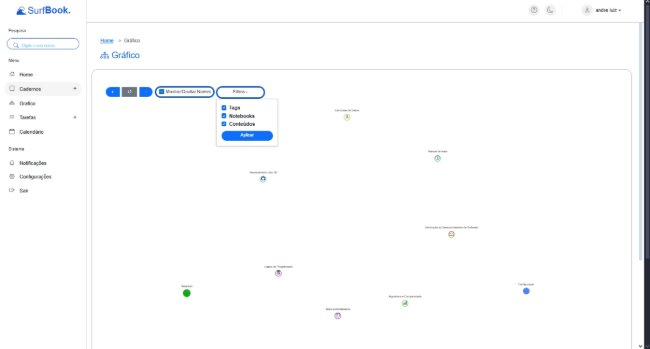

É possível alternar entre diferentes visualizações, mostrando Tags, Notebooks e Conteúdos juntos, separados, ou da forma que o usuário preferir.

![ref1]

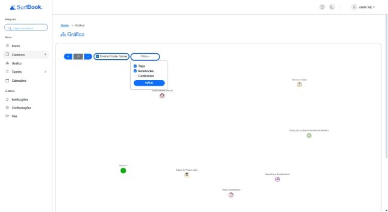

O sistema também permite visualizar os links entre conteúdos cadastrados pelo usuário, representados por nós conectados por traços que indicam as ligações entre elas.

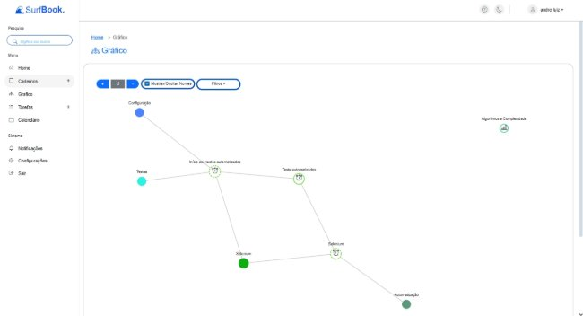

Além disso, é possível manipular os itens do gráfico, assim como aplicar zoom ou diminuir o zoom. Para mover um item, basta clicar no nó (Conteúdo, Tag ou Caderno) e arrastar com o mouse para posicioná-lo no espaço. Para usar o zoom, utilize a roda do mouse: ao girar para cima, o zoom aumenta; ao girar para baixo, o zoom diminui.

[ref1]: img/Aspose.Words.84f02760-74a3-46a4-9351-e4f033d99ac6.002.png
[ref2]: img/Aspose.Words.84f02760-74a3-46a4-9351-e4f033d99ac6.004.png
[ref3]: img/Aspose.Words.84f02760-74a3-46a4-9351-e4f033d99ac6.014.png
